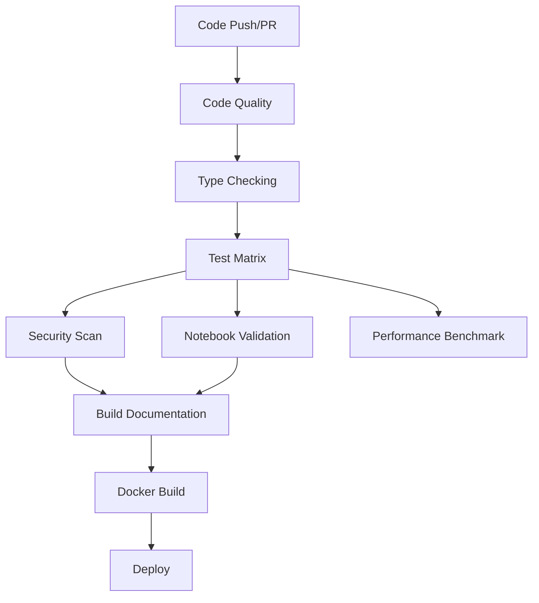

# Comprehensive CI/CD Pipeline Documentation

## Overview

This project implements a comprehensive CI/CD pipeline using GitHub Actions, Docker, and various automation tools. The pipeline ensures code quality, security, performance, and reliable deployments.

## Pipeline Architecture



## GitHub Actions Workflows

### 1. Main CI/CD Pipeline (`ci.yml`)

The primary workflow that runs on every push and pull request.

#### Jobs:

- **code-quality**: Runs linting, formatting checks, and code complexity analysis
- **typecheck**: Static type checking with mypy
- **test-matrix**: Tests across multiple Python versions (3.9-3.12) and OS (Ubuntu, Windows, macOS)
- **notebook-validation**: Validates and executes Jupyter notebooks
- **performance-benchmark**: Runs performance benchmarks and stores results
- **test-integration**: Integration tests with PostgreSQL and Redis
- **test-data**: Data quality validation tests
- **security-scan**: Security vulnerability scanning
- **build-documentation**: Builds and deploys documentation
- **docker-build**: Builds and pushes Docker images

### 2. Release Pipeline (`release.yml`)

Handles version releases and deployments.

Features:
- Automated changelog generation
- PyPI package publishing
- Docker image tagging with versions
- GitHub release creation
- Documentation deployment to GitHub Pages

### 3. Dependency Updates (`dependency-update.yml`)

Automated dependency management workflow.

Features:
- Weekly dependency updates
- Security vulnerability checks
- Automated pull request creation
- Compatibility testing

### 4. CodeQL Security Analysis (`codeql-analysis.yml`)

Advanced security analysis using GitHub's CodeQL.

Features:
- Static code analysis
- Security vulnerability detection
- License compliance checking
- Dependency review for PRs

## Docker Configuration

### Multi-Stage Dockerfile

Our Dockerfile uses multi-stage builds for optimization:

1. **Base Stage**: System dependencies
2. **Dependencies Stage**: Python packages
3. **Application Stage**: Application code
4. **Service-Specific Stages**: ML API, Dashboard, Jupyter
5. **Production Stage**: Optimized runtime

### Docker Compose Services

```yaml
services:
  - postgres       # Database
  - redis          # Cache
  - minio          # Object storage
  - ml-api         # Machine learning API
  - dashboard      # Web dashboard
  - automl         # AutoML service
  - prometheus     # Monitoring
  - grafana        # Visualization
  - jupyter        # Development
```

## Testing Strategy

### Test Levels

1. **Unit Tests**: Fast, isolated component tests
2. **Integration Tests**: Service interaction tests
3. **Performance Benchmarks**: Speed and resource usage tests
4. **Data Quality Tests**: Data validation and integrity
5. **Notebook Tests**: Jupyter notebook execution validation

### Test Coverage

- Minimum coverage threshold: 95%
- Coverage reporting via Codecov
- Per-module coverage tracking

### Benchmark Tests

Located in `tests/benchmarks/test_performance.py`:

- Data processing operations
- Statistical computations
- ML model training/inference
- API serialization
- Memory optimization
- Parallel processing

## Security Features

### Vulnerability Scanning

- **Bandit**: Python security linting
- **Safety**: Dependency vulnerability checks
- **pip-audit**: Package audit
- **Trivy**: Container scanning
- **CodeQL**: Advanced code analysis

### Security Best Practices

1. No secrets in code (enforced by scanning)
2. Dependency vulnerability monitoring
3. Container security scanning
4. SARIF report uploads to GitHub Security tab
5. License compliance checking

## Performance Optimization

### Benchmarking

- Automated performance regression detection
- Benchmark results stored and tracked over time
- Memory profiling for optimization opportunities
- Parallel processing benchmarks

### Caching Strategy

- Docker layer caching
- GitHub Actions cache for dependencies
- pip cache optimization
- Build artifact caching

## Documentation

### Automated Documentation

- Sphinx-based API documentation
- Auto-generated from docstrings
- Deployed to GitHub Pages on main branch
- Version-specific documentation

### Documentation Types

1. **API Reference**: Auto-generated from code
2. **User Guides**: Markdown-based guides
3. **Jupyter Notebooks**: Interactive examples
4. **Architecture Diagrams**: Mermaid diagrams

## Deployment

### Environments

1. **Development**: Local Docker Compose
2. **Staging**: Feature branch deployments
3. **Production**: Main branch deployments

### Deployment Process

```bash
# Local development
docker-compose up -d

# Production deployment
docker-compose -f docker-compose.yml -f docker-compose.prod.yml up -d

# Scaling services
docker-compose up -d --scale ml-api=3
```

## Monitoring and Observability

### Metrics Collection

- Prometheus metrics endpoint
- Custom application metrics
- Performance benchmarks
- Test coverage metrics

### Dashboards

- Grafana dashboards for visualization
- GitHub Actions workflow insights
- Codecov coverage reports
- Security scanning dashboards

## Development Workflow

### Local Development

```bash
# Install development dependencies
pip install -r requirements-dev.txt

# Run pre-commit hooks
pre-commit install
pre-commit run --all-files

# Run tests locally
pytest tests/ --cov=src/ --cov-report=html

# Run benchmarks
pytest tests/benchmarks/ --benchmark-only
```

### Pull Request Process

1. Create feature branch
2. Make changes with tests
3. Run local validation
4. Push and create PR
5. Automated CI runs
6. Code review
7. Merge to main

## Configuration Files

### Required Files

- `.github/workflows/*.yml`: GitHub Actions workflows
- `Dockerfile`: Container definitions
- `docker-compose.yml`: Service orchestration
- `requirements.txt`: Production dependencies
- `requirements-dev.txt`: Development dependencies
- `requirements-test.txt`: Test dependencies
- `.pre-commit-config.yaml`: Pre-commit hooks
- `pyproject.toml`: Project configuration
- `setup.py`: Package configuration

### Environment Variables

```env
# Database
POSTGRES_USER=mluser
POSTGRES_PASSWORD=secure_password
POSTGRES_DB=mldb

# Redis
REDIS_URL=redis://redis:6379

# API Keys
API_KEY=your_api_key
SECRET_KEY=your_secret_key

# Docker Hub (for CI/CD)
DOCKER_USERNAME=your_username
DOCKER_PASSWORD=your_password

# PyPI (for releases)
PYPI_API_TOKEN=your_token
```

## Maintenance

### Regular Tasks

- **Weekly**: Dependency updates (automated)
- **Monthly**: Security audit review
- **Quarterly**: Performance baseline update
- **Annually**: Major version planning

### Monitoring Checklist

- [ ] GitHub Actions status
- [ ] Test coverage trends
- [ ] Security vulnerabilities
- [ ] Performance benchmarks
- [ ] Docker image sizes
- [ ] Documentation completeness

## Troubleshooting

### Common Issues

1. **Test Failures**: Check test logs in GitHub Actions
2. **Docker Build Fails**: Verify Dockerfile syntax and dependencies
3. **Coverage Below Threshold**: Add more tests or adjust threshold
4. **Security Vulnerabilities**: Update affected dependencies
5. **Performance Regression**: Review benchmark results

### Debug Commands

```bash
# Debug GitHub Actions locally
act push

# Debug Docker build
docker build --no-cache --progress=plain .

# Debug specific test
pytest tests/path/to/test.py -vvs

# Check for security issues
bandit -r src/
safety check
pip-audit
```

## Contributing

See [CONTRIBUTING.md](CONTRIBUTING.md) for contribution guidelines.

## License

This project's CI/CD pipeline configuration is available under the project license.