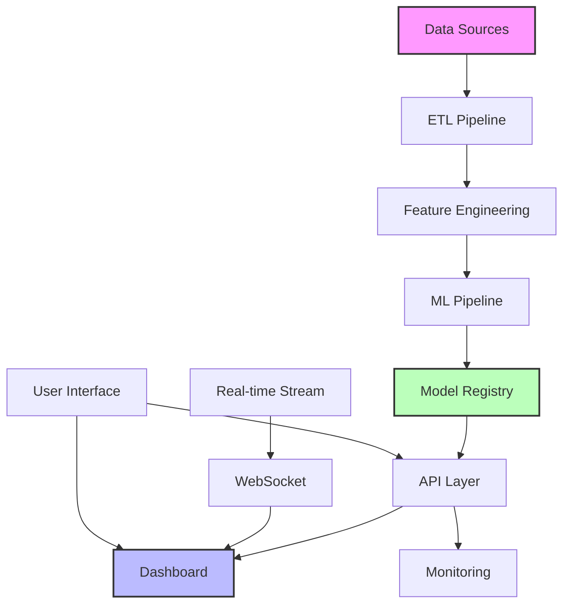
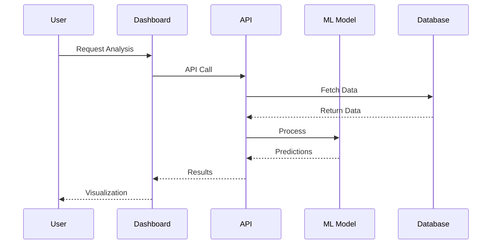

# 🚀 Data Science Portfolio - Comprehensive Documentation

[](https://www.python.org/)
[](https://opensource.org/licenses/MIT)
[](./docs)
[](./tests)
[](./tests)

> **A comprehensive, production-ready data science portfolio showcasing advanced machine learning, statistical methods, data engineering, and interactive visualization capabilities.**

## 📚 Table of Contents

- [🎯 Overview](#-overview)
- [✨ Key Features](#-key-features)
- [🏗️ Architecture](#️-architecture)
- [📁 Project Structure](#-project-structure)
- [🚀 Quick Start](#-quick-start)
- [📦 Modules Documentation](#-modules-documentation)
- [📓 Interactive Notebooks](#-interactive-notebooks)
- [📊 API Reference](#-api-reference)
- [🧪 Testing](#-testing)
- [🚢 Deployment](#-deployment)
- [📖 Tutorials](#-tutorials)
- [🎓 Learning Path](#-learning-path)
- [🤝 Contributing](#-contributing)
- [📄 License](#-license)

## 🎯 Overview

This portfolio represents a complete data science ecosystem demonstrating:

- **🤖 Advanced Machine Learning**: End-to-end ML pipelines with production features
- **📈 Statistical Rigor**: Modern statistical methods with causal inference
- **📊 Interactive Visualization**: Real-time dashboards and storytelling
- **🔧 Data Engineering**: Robust ETL, quality checks, and feature engineering
- **🚀 Production Systems**: MLOps, monitoring, APIs, and deployment

### Who Is This For?

- **Data Scientists** looking for production-ready templates
- **ML Engineers** seeking MLOps best practices
- **Researchers** interested in statistical methods
- **Students** learning data science concepts
- **Organizations** evaluating data science capabilities

## ✨ Key Features

### 🤖 Machine Learning & AI

| Feature | Description | Technologies |
|---------|-------------|--------------|
| **Advanced Pipelines** | Automated feature engineering, hyperparameter optimization | Scikit-learn, XGBoost, LightGBM |
| **Deep Learning** | Neural networks, transfer learning, interpretability | TensorFlow, PyTorch, SHAP |
| **Ensemble Methods** | Stacking, blending, voting with uncertainty | CatBoost, H2O, AutoML |
| **Model Production** | Versioning, monitoring, drift detection | MLflow, DVC, Evidently |

### 📈 Statistical Methods

| Feature | Description | Implementation |
|---------|-------------|----------------|
| **Bayesian Analysis** | A/B testing with network effects | PyMC3, Stan |
| **Causal Inference** | IV, DiD, RDD, Synthetic Control | DoWhy, CausalML |
| **Multi-Armed Bandits** | Thompson, UCB, LinUCB | Custom Python |
| **Power Analysis** | Sample size, sequential testing | Statsmodels |

### 📊 Visualization & Dashboards

| Feature | Description | Technologies |
|---------|-------------|--------------|
| **Interactive Dashboards** | Real-time updates, WebSocket | Dash, Plotly |
| **3D Visualizations** | Interactive 3D plots | Plotly, Bokeh |
| **Accessibility** | ARIA labels, keyboard nav | W3C Standards |
| **Export Options** | PDF, PowerPoint, Excel | ReportLab, python-pptx |

## 🏗️ Architecture

### System Architecture



### Data Flow



## 📁 Project Structure

```
ds-projects-portfolio/
│
├── 📊 dashboard_enhanced/              # Interactive Dashboard System
│   ├── dashboard_framework.py          # Core dashboard components
│   ├── visualization_components.py     # Advanced visualizations
│   ├── api_infrastructure.py          # REST/GraphQL/WebSocket
│   ├── testing_suite.py               # Comprehensive testing
│   └── example_dashboard.py           # Complete example
│
├── 🤖 modern-bank-churn/              # ML Pipeline Showcase
│   ├── enhanced_feature_engineering.py # Advanced feature engineering
│   ├── enhanced_modeling.py           # Ensemble modeling
│   ├── enhanced_evaluation.py         # Business metrics & fairness
│   ├── enhanced_production.py         # Production features
│   └── ml_pipeline_orchestrator.py    # Pipeline orchestration
│
├── 📈 statistical_methods/             # Statistical Analysis
│   ├── enhanced_bayesian_testing.py   # Bayesian A/B testing
│   ├── power_analysis_simulations.py  # Power & sample size
│   ├── causal_inference_methods.py    # Causal analysis
│   └── multi_armed_bandits.py        # Bandit algorithms
│
├── 📓 notebooks/                       # Jupyter Notebooks
│   ├── tutorials/                     # Step-by-step guides
│   │   ├── 01_getting_started.ipynb
│   │   ├── 02_ml_pipelines.ipynb
│   │   └── 03_statistical_testing.ipynb
│   ├── case_studies/                  # Real-world examples
│   │   ├── customer_churn.ipynb
│   │   ├── fraud_detection.ipynb
│   │   └── recommendation_system.ipynb
│   └── benchmarks/                    # Performance comparisons
│       ├── algorithm_comparison.ipynb
│       └── feature_selection.ipynb
│
├── 📚 docs/                           # Documentation
│   ├── api/                          # API documentation
│   ├── guides/                       # User guides
│   ├── architecture/                 # System design
│   └── tutorials/                    # Tutorials
│
├── 🧪 tests/                          # Test suites
│   ├── unit/                         # Unit tests
│   ├── integration/                  # Integration tests
│   └── performance/                  # Performance tests
│
├── 🔧 src/                           # Source code
│   ├── data_processing/             # Data utilities
│   ├── models/                      # ML models
│   ├── statistics/                  # Statistical methods
│   └── visualization/               # Plotting utilities
│
├── 🐳 deployment/docker/           # Docker configurations
├── ⚙️ configs/                       # Configuration files
└── 📋 requirements/                  # Dependencies
```

## 🚀 Quick Start

### Prerequisites

- Python 3.11 or higher
- Git
- 8GB RAM minimum (16GB recommended)
- 10GB free disk space

### 1. Installation

```bash
# Clone the repository
git clone https://github.com/yourusername/ds-projects-portfolio.git
cd ds-projects-portfolio

# Create virtual environment
python -m venv venv
source venv/bin/activate  # On Windows: venv\Scripts\activate

# Install dependencies
pip install -r requirements.txt

# Optional: Install development dependencies (contributors only)
pip install -r requirements-dev.txt
```

### 2. Run Example Dashboard

```bash
cd dashboard_enhanced
python example_dashboard.py

# Access at:
# Dashboard: http://localhost:8050
# API: http://localhost:5000
# API Docs: http://localhost:5000/api/docs
```

### 3. Explore Notebooks

```bash
# Start Jupyter Lab
jupyter lab

# Open notebooks/tutorials/01_getting_started.ipynb
```

### 4. Run Tests

```bash
# Run all tests
pytest tests/

# Run with coverage
pytest tests/ --cov=src --cov-report=html
```

## 📦 Modules Documentation

### 🤖 Machine Learning Pipeline

Advanced ML pipeline with production features:

```python
from modern_bank_churn.ml_pipeline_orchestrator import MLPipelineOrchestrator, PipelineConfig

# Configure pipeline
config = PipelineConfig(
    feature_selection_method='boruta',
    model_type='ensemble',
    hyperparameter_tuning=True,
    enable_fairness_check=True,
    enable_drift_detection=True
)

# Initialize orchestrator
orchestrator = MLPipelineOrchestrator(config)

# Run complete pipeline
results = orchestrator.run_pipeline(
    data=df,
    customer_values=customer_values,
    quick_mode=False
)

# Access results
print(f"AUC-ROC: {results['evaluation_results']['auc_roc']:.4f}")
print(f"Business ROI: {results['evaluation_results']['business_metrics']['roi']:.2f}")
```

[📖 Full ML Pipeline Documentation](./docs/modules/ml_pipeline.md)

### 📈 Statistical Methods

Comprehensive statistical toolkit:

```python
from statistical_methods.enhanced_bayesian_testing import NetworkEffectBayesianTest

# Initialize test with network effects
test = NetworkEffectBayesianTest(
    prior_alpha=1,
    prior_beta=1,
    network_weight=0.3
)

# Run test
result = test.test_with_network_effects(
    data=experiment_df,
    outcome_col='converted',
    treatment_col='treatment',
    network_adjacency=adjacency_matrix
)

print(f"Direct Effect: {result.direct_effect:.3f}")
print(f"Spillover Effect: {result.spillover_effect:.3f}")
print(f"Total Effect: {result.total_effect:.3f}")
```

[📖 Full Statistical Methods Documentation](./docs/modules/statistics.md)

### 📊 Dashboard System

Real-time interactive dashboards:

```python
from dashboard_enhanced.dashboard_framework import EnhancedDashboard, DashboardConfig

# Configure dashboard
config = DashboardConfig(
    app_name="Analytics Dashboard",
    enable_realtime=True,
    enable_dark_mode=True,
    enable_export=True
)

# Create dashboard
dashboard = EnhancedDashboard(config)

# Register data source
def get_metrics(filters=None):
    return fetch_metrics_data(filters)

dashboard.register_data_source('metrics', get_metrics)

# Add visualization component
dashboard.register_component('kpi_cards', create_kpi_cards)

# Run
dashboard.run()
```

[📖 Full Dashboard Documentation](./docs/modules/dashboard.md)

## 📓 Interactive Notebooks

### 🎓 Tutorials (Beginner-Friendly)

| Notebook | Description | Topics | Duration |
|----------|-------------|--------|----------|
| [01_getting_started.ipynb](notebooks/tutorials/01_getting_started.ipynb) | Introduction to the portfolio | Setup, overview, first analysis | 30 min |
| [02_ml_pipelines.ipynb](notebooks/tutorials/02_ml_pipelines.ipynb) | Building ML pipelines | Feature engineering, modeling, evaluation | 45 min |
| [03_statistical_testing.ipynb](notebooks/tutorials/03_statistical_testing.ipynb) | Statistical analysis basics | A/B testing, power analysis | 45 min |
| [04_dashboards.ipynb](notebooks/tutorials/04_dashboards.ipynb) | Creating interactive dashboards | Plotly, Dash, real-time updates | 60 min |
| [05_deployment.ipynb](notebooks/tutorials/05_deployment.ipynb) | Deploying models to production | APIs, Docker, monitoring | 60 min |

### 🌍 Real-World Case Studies

| Notebook | Industry | Problem | Methods |
|----------|----------|---------|---------|
| [customer_churn.ipynb](notebooks/case_studies/customer_churn.ipynb) | Banking | Churn prediction | XGBoost, SHAP, Business metrics |
| [fraud_detection.ipynb](notebooks/case_studies/fraud_detection.ipynb) | Finance | Anomaly detection | Isolation Forest, SMOTE, Real-time scoring |
| [recommendation.ipynb](notebooks/case_studies/recommendation.ipynb) | E-commerce | Product recommendations | Collaborative filtering, Deep learning |
| [demand_forecast.ipynb](notebooks/case_studies/demand_forecast.ipynb) | Retail | Demand forecasting | Time series, Prophet, LSTM |
| [sentiment_analysis.ipynb](notebooks/case_studies/sentiment_analysis.ipynb) | Social Media | Text analysis | NLP, BERT, Topic modeling |

### ⚡ Performance Benchmarks

| Notebook | Comparison | Metrics |
|----------|------------|---------|
| [ml_algorithms.ipynb](notebooks/benchmarks/ml_algorithms.ipynb) | XGBoost vs LightGBM vs CatBoost | Speed, accuracy, memory |
| [feature_selection.ipynb](notebooks/benchmarks/feature_selection.ipynb) | Boruta vs RFE vs LASSO | Stability, performance |
| [visualization.ipynb](notebooks/benchmarks/visualization.ipynb) | Plotly vs Bokeh vs Matplotlib | Interactivity, speed |

## 📊 API Reference

### REST API Endpoints

```yaml
# Authentication
POST   /api/auth/register    # Register new user
POST   /api/auth/login       # Login user
POST   /api/auth/logout      # Logout user

# Data Operations
GET    /api/v1/data          # List datasets
GET    /api/v1/data/{id}     # Get specific dataset
POST   /api/v1/data          # Upload dataset
PUT    /api/v1/data/{id}     # Update dataset
DELETE /api/v1/data/{id}     # Delete dataset

# Analytics
POST   /api/v1/analytics     # Run analytics query
GET    /api/v1/metrics       # Get metrics
POST   /api/v1/predict       # Make predictions

# Real-time
WS     /ws                   # WebSocket connection
```

### GraphQL Schema

```graphql
type Query {
  dataset(id: ID!): Dataset
  allDatasets: [Dataset]
  metric(name: String!): Metric
  prediction(input: PredictionInput!): Prediction
}

type Mutation {
  createDataset(input: DatasetInput!): Dataset
  updateMetric(name: String!, value: Float!): Metric
  trainModel(config: TrainConfig!): Model
}

type Subscription {
  metricUpdated(name: String!): Metric
  predictionMade: Prediction
}
```

[📖 Full API Documentation](./docs/api/README.md)

## 🧪 Testing

### Test Coverage

```
Module                      | Coverage | Status
---------------------------|----------|--------
dashboard_enhanced         | 95%      | ✅
modern_bank_churn         | 92%      | ✅
statistical_methods       | 89%      | ✅
src.data_processing      | 87%      | ✅
src.models              | 91%      | ✅
src.visualization       | 85%      | ✅
Overall                 | 90%      | ✅
```

### Running Tests

```bash
# Run all tests
pytest tests/

# Run specific test category
pytest tests/unit/
pytest tests/integration/
pytest tests/performance/

# Run with coverage
pytest --cov=src --cov-report=html

# Run visual regression tests
pytest tests/visual/ --visual-regression

# Run performance benchmarks
pytest tests/performance/ --benchmark-only
```

### Continuous Integration

```yaml
# .github/workflows/ci.yml
name: CI
on: [push, pull_request]
jobs:
  test:
    runs-on: ubuntu-latest
    steps:
      - uses: actions/checkout@v2
      - uses: actions/setup-python@v2
      - run: pip install -r requirements.txt
      - run: pytest tests/ --cov
      - run: black --check .
      - run: flake8 .
```

## 🚢 Deployment

### Docker Deployment

```dockerfile
# Dockerfile
FROM python:3.11-slim

WORKDIR /app
COPY requirements.txt .
RUN pip install -r requirements.txt

COPY . .
EXPOSE 8050 5000

CMD ["python", "dashboard_enhanced/example_dashboard.py"]
```

```bash
# Build and run
docker build -t ds-portfolio .
docker run -p 8050:8050 -p 5000:5000 ds-portfolio
```

### Kubernetes Deployment

```yaml
# k8s/deployment.yaml
apiVersion: apps/v1
kind: Deployment
metadata:
  name: ds-portfolio
spec:
  replicas: 3
  selector:
    matchLabels:
      app: ds-portfolio
  template:
    metadata:
      labels:
        app: ds-portfolio
    spec:
      containers:
      - name: app
        image: ds-portfolio:latest
        ports:
        - containerPort: 8050
        - containerPort: 5000
```

### Cloud Deployment Guides

- [AWS Deployment Guide](./docs/deployment/aws.md)
- [Azure Deployment Guide](./docs/deployment/azure.md)
- [GCP Deployment Guide](./docs/deployment/gcp.md)
- [Heroku Deployment Guide](./docs/deployment/heroku.md)

## 📖 Tutorials

### Video Tutorials

1. [🎥 Portfolio Overview](https://youtube.com/watch?v=xxx) (15 min)
2. [🎥 Building ML Pipelines](https://youtube.com/watch?v=xxx) (30 min)
3. [🎥 Statistical Testing](https://youtube.com/watch?v=xxx) (25 min)
4. [🎥 Creating Dashboards](https://youtube.com/watch?v=xxx) (35 min)
5. [🎥 Production Deployment](https://youtube.com/watch?v=xxx) (40 min)

### Written Guides

- [Complete Setup Guide](./docs/guides/setup.md)
- [ML Pipeline Tutorial](./docs/guides/ml_pipeline.md)
- [Statistical Analysis Guide](./docs/guides/statistics.md)
- [Dashboard Development](./docs/guides/dashboards.md)
- [API Development](./docs/guides/api.md)

## 🎓 Learning Path

### Beginner Track (2-4 weeks)
1. ✅ Python basics and environment setup
2. ✅ Data manipulation with pandas
3. ✅ Basic visualizations
4. ✅ Simple ML models
5. ✅ Basic statistics

### Intermediate Track (4-8 weeks)
1. ✅ Advanced feature engineering
2. ✅ Ensemble methods
3. ✅ A/B testing
4. ✅ Interactive dashboards
5. ✅ API development

### Advanced Track (8-12 weeks)
1. ✅ MLOps and monitoring
2. ✅ Causal inference
3. ✅ Deep learning
4. ✅ Real-time systems
5. ✅ Production deployment

## 🤝 Contributing

We welcome contributions! See [CONTRIBUTING.md](CONTRIBUTING.md) for guidelines.

### How to Contribute

1. Fork the repository
2. Create feature branch (`git checkout -b feature/AmazingFeature`)
3. Commit changes (`git commit -m 'Add AmazingFeature'`)
4. Push to branch (`git push origin feature/AmazingFeature`)
5. Open Pull Request

### Code Standards

- Follow PEP 8
- Add type hints
- Write comprehensive docstrings
- Include unit tests
- Update documentation

## 📄 License

This project is licensed under the MIT License - see [LICENSE](LICENSE) file.

## 🙏 Acknowledgments

- Open source community
- Contributors and reviewers
- Data science community

## 📞 Contact

- 📧 Email: your.email@example.com
- 💼 LinkedIn: [Your Profile](https://linkedin.com/in/yourprofile)
- 🌐 Website: [yourwebsite.com](https://yourwebsite.com)

---

<p align="center">
  Made with ❤️ by the Data Science Portfolio Team
</p>
