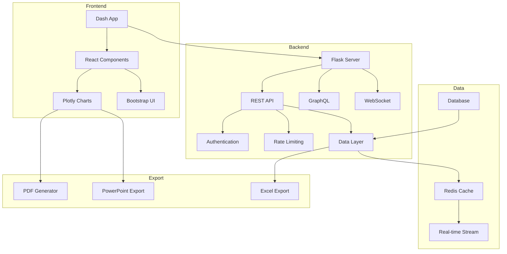

# 🎨 Dashboard Module

## Overview

The Dashboard module provides a comprehensive, production-ready dashboard system with real-time data streaming, interactive visualizations, API infrastructure, and extensive testing capabilities. Built on Dash, Flask, and modern web technologies.

## 🏗️ Architecture



## 📦 Components

### Core Classes

#### `EnhancedDashboard`
Main dashboard framework class.

```python
from dashboard_framework import EnhancedDashboard, DashboardConfig

config = DashboardConfig(
    app_name="Analytics Dashboard",
    enable_realtime=True,
    enable_dark_mode=True
)

dashboard = EnhancedDashboard(config)
dashboard.run()
```

#### `InteractiveVisualizations`
Advanced visualization components.

```python
from visualization_components import InteractiveVisualizations

viz = InteractiveVisualizations()
fig = viz.create_animated_time_series(df, x_col='date', y_cols=['metric'])
```

#### `APIInfrastructure`
REST, GraphQL, and WebSocket APIs.

```python
from api_infrastructure import APIInfrastructure

api = APIInfrastructure()
api.setup_routes()
api.enable_authentication()
```

#### `TestingSuite`
Comprehensive testing framework.

```python
from testing_suite import TestingSuite

suite = TestingSuite()
suite.run_all_tests()
```

## 🚀 Quick Start

### Installation

```bash
# Install dependencies
pip install -r dashboard_enhanced/requirements.txt

# Install Redis (for real-time features)
# Ubuntu/Debian
sudo apt-get install redis-server

# macOS
brew install redis

# Install browser drivers (for testing)
playwright install
```

### Basic Usage

```python
from dashboard_framework import EnhancedDashboard, DashboardConfig
import pandas as pd

# Configure dashboard
config = DashboardConfig(
    app_name="Sales Dashboard",
    port=8050,
    enable_realtime=True,
    enable_export=True,
    enable_dark_mode=True
)

# Create dashboard instance
dashboard = EnhancedDashboard(config)

# Register data source
def get_sales_data(filters=None):
    # Load and filter data
    df = pd.read_csv('sales.csv')
    if filters:
        df = apply_filters(df, filters)
    return df

dashboard.register_data_source('sales', get_sales_data)

# Add visualizations
dashboard.add_chart('revenue_trend', chart_type='line')
dashboard.add_chart('product_mix', chart_type='pie')
dashboard.add_chart('geo_map', chart_type='choropleth')

# Run dashboard
dashboard.run()
```

## � Baseline Metrics for Portfolio Dashboards

A portfolio dashboard is most effective when it combines business outcomes with operational health. Define baseline metrics before launch so every chart and KPI has a consistent reference point.

### Recommended baseline metrics

- `conversion_rate`: baseline conversion or adoption rate for core funnel actions.
- `retention_rate`: expected retention over a standard period (e.g. 30-day retention).
- `revenue_trend`: revenue or value growth normalized to a baseline period.
- `engagement_score`: composite measure of active sessions, feature use, or time on task.
- `churn_rate`: percentage of users, customers, or accounts leaving the portfolio.
- `average_session_duration`: session length benchmark for healthy engagement.
- `cost_per_acquisition`: acquisition efficiency relative to revenue or margin.
- `forecast_accuracy`: model or business forecast performance versus baseline expectations.
- `operational_health`: data freshness, pipeline latency, and error-rate guardrails.

### How to define baseline metrics

1. Align baseline selection with portfolio objectives: growth, retention, monetization, or efficiency.
2. Use a stable historical window (e.g. last 30 or 90 days) as the baseline period.
3. Include both primary business metrics and guardrail metrics to avoid unintended regressions.
4. Display both absolute values and relative change versus baseline for quick decision making.
5. Annotate dashboards with the baseline date range, data source, and update cadence.

### Practical dashboard guidance

- Show baseline values alongside current performance on key cards or KPI tiles.
- Use trend charts with shaded baseline bands to indicate expected ranges.
- Keep metric definitions consistent across portfolio dashboards so stakeholders can compare programs easily.
- Refresh baseline snapshots periodically to reflect seasonality or strategy changes, while keeping historical comparisons intact.

## �📚 API Reference

### EnhancedDashboard

```python
class EnhancedDashboard:
    """
    Production-ready dashboard framework.

    Parameters
    ----------
    config : DashboardConfig
        Dashboard configuration object
    """

    def __init__(self, config):
        """Initialize dashboard with configuration."""
        pass

    def register_data_source(self, name, func, cache_timeout=300):
        """
        Register a data source function.

        Parameters
        ----------
        name : str
            Data source identifier
        func : callable
            Function that returns DataFrame
        cache_timeout : int
            Cache timeout in seconds

        Returns
        -------
        None
        """
        pass

    def add_chart(self, chart_id, chart_type='line', **kwargs):
        """
        Add a chart to the dashboard.

        Parameters
        ----------
        chart_id : str
            Unique chart identifier
        chart_type : str
            Type of chart ('line', 'bar', 'scatter', etc.)
        **kwargs : dict
            Additional chart configuration

        Returns
        -------
        None
        """
        pass

    def enable_realtime(self, channel='default', interval=5000):
        """
        Enable real-time data updates.

        Parameters
        ----------
        channel : str
            WebSocket channel name
        interval : int
            Update interval in milliseconds

        Returns
        -------
        None
        """
        pass

    def export_to_pdf(self, figures, filename='report.pdf'):
        """
        Export dashboard to PDF.

        Parameters
        ----------
        figures : list
            List of plotly figures
        filename : str
            Output filename

        Returns
        -------
        str
            Path to generated PDF
        """
        pass

    def export_to_powerpoint(self, figures, filename='presentation.pptx'):
        """
        Export dashboard to PowerPoint.

        Parameters
        ----------
        figures : list
            List of plotly figures
        filename : str
            Output filename

        Returns
        -------
        str
            Path to generated PPTX
        """
        pass
```

### DashboardConfig

```python
class DashboardConfig:
    """
    Dashboard configuration settings.

    Parameters
    ----------
    app_name : str
        Application name
    host : str, default='127.0.0.1'
        Server host
    port : int, default=8050
        Server port
    debug : bool, default=False
        Debug mode
    enable_realtime : bool, default=False
        Enable real-time updates
    enable_export : bool, default=True
        Enable export functionality
    enable_dark_mode : bool, default=True
        Enable dark mode toggle
    enable_accessibility : bool, default=True
        Enable accessibility features
    cache_timeout : int, default=300
        Default cache timeout
    redis_host : str, default='localhost'
        Redis server host
    redis_port : int, default=6379
        Redis server port
    """
    pass
```

### InteractiveVisualizations

```python
class InteractiveVisualizations:
    """
    Advanced visualization components.
    """

    def create_animated_time_series(self, df, x_col, y_cols,
                                   title='', animation_speed=100):
        """
        Create animated time series chart.

        Parameters
        ----------
        df : pd.DataFrame
            Data frame
        x_col : str
            X-axis column
        y_cols : list
            Y-axis columns
        title : str
            Chart title
        animation_speed : int
            Animation speed in ms

        Returns
        -------
        plotly.graph_objects.Figure
            Animated figure
        """
        pass

    def create_interactive_3d_scatter(self, df, x_col, y_col, z_col,
                                     color_col=None, size_col=None):
        """
        Create 3D scatter plot.

        Parameters
        ----------
        df : pd.DataFrame
            Data frame
        x_col, y_col, z_col : str
            Axis columns
        color_col : str, optional
            Color mapping column
        size_col : str, optional
            Size mapping column

        Returns
        -------
        plotly.graph_objects.Figure
            3D scatter figure
        """
        pass

    def create_sankey_diagram(self, df, source_col, target_col,
                             value_col, title=''):
        """
        Create Sankey flow diagram.

        Parameters
        ----------
        df : pd.DataFrame
            Flow data
        source_col : str
            Source node column
        target_col : str
            Target node column
        value_col : str
            Flow value column
        title : str
            Diagram title

        Returns
        -------
        plotly.graph_objects.Figure
            Sankey figure
        """
        pass

    def create_sunburst_chart(self, df, path_cols, value_col,
                             color_col=None):
        """
        Create hierarchical sunburst chart.

        Parameters
        ----------
        df : pd.DataFrame
            Hierarchical data
        path_cols : list
            Hierarchy path columns
        value_col : str
            Value column
        color_col : str, optional
            Color mapping column

        Returns
        -------
        plotly.graph_objects.Figure
            Sunburst figure
        """
        pass

    def create_parallel_coordinates(self, df, dimensions,
                                   color_col=None):
        """
        Create parallel coordinates plot.

        Parameters
        ----------
        df : pd.DataFrame
            Multi-dimensional data
        dimensions : list
            Dimension columns
        color_col : str, optional
            Color mapping column

        Returns
        -------
        plotly.graph_objects.Figure
            Parallel coordinates figure
        """
        pass
```

### APIInfrastructure

```python
class APIInfrastructure:
    """
    REST, GraphQL, and WebSocket API infrastructure.
    """

    def setup_routes(self):
        """Set up all API routes."""
        pass

    def enable_authentication(self, jwt_secret=None):
        """
        Enable JWT authentication.

        Parameters
        ----------
        jwt_secret : str, optional
            JWT secret key

        Returns
        -------
        None
        """
        pass

    def add_rest_endpoint(self, path, methods=['GET'],
                         auth_required=True):
        """
        Add REST API endpoint.

        Parameters
        ----------
        path : str
            Endpoint path
        methods : list
            HTTP methods
        auth_required : bool
            Require authentication

        Returns
        -------
        decorator
            Endpoint decorator
        """
        pass

    def add_graphql_schema(self, schema):
        """
        Add GraphQL schema.

        Parameters
        ----------
        schema : graphene.Schema
            GraphQL schema

        Returns
        -------
        None
        """
        pass

    def enable_websocket(self):
        """Enable WebSocket support."""
        pass

    def set_rate_limit(self, limit='100 per hour'):
        """
        Set rate limiting.

        Parameters
        ----------
        limit : str
            Rate limit string

        Returns
        -------
        None
        """
        pass
```

## 📝 Examples

### Example 1: Real-time Dashboard with WebSockets

```python
from dashboard_framework import EnhancedDashboard, DashboardConfig
from visualization_components import InteractiveVisualizations
import pandas as pd
import redis

# Configure with real-time support
config = DashboardConfig(
    app_name="Real-time Analytics",
    enable_realtime=True,
    redis_host='localhost',
    redis_port=6379
)

dashboard = EnhancedDashboard(config)
viz = InteractiveVisualizations()

# Set up Redis connection
r = redis.Redis(host='localhost', port=6379)

# Real-time data callback
def get_realtime_data():
    # Get latest data from Redis
    data = r.get('metrics:latest')
    return pd.read_json(data) if data else pd.DataFrame()

# Register real-time source
dashboard.register_data_source('realtime', get_realtime_data)

# Enable WebSocket streaming
dashboard.enable_realtime(channel='metrics', interval=1000)

# Add real-time charts
dashboard.add_chart('live_metrics', chart_type='line', realtime=True)
dashboard.add_chart('current_status', chart_type='gauge', realtime=True)

dashboard.run()
```

### Example 2: Multi-Page Dashboard with Navigation

```python
from dashboard_framework import EnhancedDashboard, DashboardConfig
import dash_bootstrap_components as dbc

config = DashboardConfig(app_name="Multi-Page App")
dashboard = EnhancedDashboard(config)

# Define pages
pages = {
    'overview': {
        'title': 'Overview',
        'layout': create_overview_layout,
        'callbacks': register_overview_callbacks
    },
    'analytics': {
        'title': 'Analytics',
        'layout': create_analytics_layout,
        'callbacks': register_analytics_callbacks
    },
    'reports': {
        'title': 'Reports',
        'layout': create_reports_layout,
        'callbacks': register_reports_callbacks
    }
}

# Register pages
for page_id, page_config in pages.items():
    dashboard.add_page(
        page_id=page_id,
        title=page_config['title'],
        layout_func=page_config['layout'],
        callback_func=page_config['callbacks']
    )

# Add navigation
dashboard.add_navigation(style='tabs')

dashboard.run()
```

### Example 3: Dashboard with Advanced Filtering

```python
from dashboard_framework import EnhancedDashboard, DashboardConfig

config = DashboardConfig(app_name="Filtered Dashboard")
dashboard = EnhancedDashboard(config)

# Define filters
filters = {
    'date_range': {
        'type': 'date_range',
        'label': 'Date Range',
        'default': ['2024-01-01', '2024-12-31']
    },
    'category': {
        'type': 'multi_select',
        'label': 'Categories',
        'options': ['Electronics', 'Clothing', 'Food', 'Books'],
        'default': ['Electronics', 'Clothing']
    },
    'metric': {
        'type': 'dropdown',
        'label': 'Metric',
        'options': ['Revenue', 'Quantity', 'Profit'],
        'default': 'Revenue'
    }
}

# Register filters
for filter_id, filter_config in filters.items():
    dashboard.add_filter(filter_id, **filter_config)

# Data source with filter application
def get_filtered_data(filters):
    df = load_data()

    # Apply date filter
    df = df[(df['date'] >= filters['date_range'][0]) &
            (df['date'] <= filters['date_range'][1])]

    # Apply category filter
    df = df[df['category'].isin(filters['category'])]

    # Select metric
    metric_col = filters['metric'].lower()

    return df[['date', 'category', metric_col]]

dashboard.register_data_source('filtered_data', get_filtered_data)
dashboard.run()
```

### Example 4: Export Dashboard to PDF/PowerPoint

```python
from dashboard_framework import EnhancedDashboard
from visualization_components import InteractiveVisualizations

dashboard = EnhancedDashboard(config)
viz = InteractiveVisualizations()

# Create multiple visualizations
figures = []

# Revenue trend
fig1 = viz.create_animated_time_series(
    revenue_df,
    x_col='month',
    y_cols=['revenue', 'profit'],
    title='Revenue and Profit Trend'
)
figures.append(fig1)

# Geographic distribution
fig2 = px.choropleth(
    geo_df,
    locations='state',
    locationmode='USA-states',
    color='sales',
    title='Sales by State'
)
figures.append(fig2)

# Product mix
fig3 = viz.create_sunburst_chart(
    product_df,
    path_cols=['category', 'subcategory', 'product'],
    value_col='revenue',
    title='Product Revenue Hierarchy'
)
figures.append(fig3)

# Export to PDF
pdf_path = dashboard.export_to_pdf(
    figures,
    filename='quarterly_report.pdf',
    title='Q4 2024 Report',
    author='Analytics Team'
)

# Export to PowerPoint
pptx_path = dashboard.export_to_powerpoint(
    figures,
    filename='board_presentation.pptx',
    template='corporate_template.pptx'
)

print(f"PDF saved to: {pdf_path}")
print(f"PowerPoint saved to: {pptx_path}")
```

### Example 5: API Integration

```python
from api_infrastructure import APIInfrastructure
import pandas as pd

api = APIInfrastructure()

# Enable authentication
api.enable_authentication(jwt_secret='your-secret-key')

# Add REST endpoints
@api.add_rest_endpoint('/api/v1/data', methods=['GET', 'POST'])
def handle_data(request):
    if request.method == 'GET':
        # Return data
        df = load_data()
        return df.to_json(orient='records')
    elif request.method == 'POST':
        # Process new data
        data = request.get_json()
        process_data(data)
        return {'status': 'success'}

# GraphQL schema
import graphene

class Metric(graphene.ObjectType):
    name = graphene.String()
    value = graphene.Float()
    timestamp = graphene.DateTime()

class Query(graphene.ObjectType):
    metrics = graphene.List(Metric)

    def resolve_metrics(self, info):
        df = load_metrics()
        return [Metric(**row) for _, row in df.iterrows()]

schema = graphene.Schema(query=Query)
api.add_graphql_schema(schema)

# WebSocket for real-time updates
@api.websocket_handler('metrics')
def handle_metrics_subscription(ws):
    while True:
        data = get_latest_metrics()
        ws.send(json.dumps(data))
        time.sleep(5)

# Rate limiting
api.set_rate_limit('1000 per hour')

# Run API server
api.run(host='0.0.0.0', port=5000)
```

## 🎯 Best Practices

### 1. **Performance Optimization**
```python
# Use data sampling for large datasets
config = DashboardConfig(
    max_data_points=10000,
    enable_sampling=True
)

# Implement caching
dashboard.enable_caching(
    backend='redis',
    default_timeout=300
)

# Use lazy loading
dashboard.enable_lazy_loading()
```

### 2. **Responsive Design**
```python
# Mobile-responsive layout
dashboard.set_layout_breakpoints({
    'xs': 0,
    'sm': 576,
    'md': 768,
    'lg': 992,
    'xl': 1200
})

# Adaptive chart sizing
dashboard.enable_responsive_charts()
```

### 3. **Accessibility**
```python
# Enable accessibility features
config = DashboardConfig(
    enable_accessibility=True,
    high_contrast_mode=True,
    keyboard_navigation=True
)

# Add ARIA labels
dashboard.add_aria_labels({
    'main_chart': 'Main revenue chart showing monthly trends',
    'filter_panel': 'Data filtering options'
})
```

### 4. **Error Handling**
```python
# Global error handler
@dashboard.error_handler
def handle_error(error):
    logger.error(f"Dashboard error: {error}")
    return render_error_page(error)

# Data source error handling
def safe_data_loader(filters):
    try:
        return load_data(filters)
    except Exception as e:
        logger.warning(f"Data load failed: {e}")
        return get_cached_data(filters)
```

### 5. **Security**
```python
# Input sanitization
from dashboard_framework.security import sanitize_input

@dashboard.callback
def update_chart(user_input):
    clean_input = sanitize_input(user_input)
    return process_data(clean_input)

# CSRF protection
dashboard.enable_csrf_protection()

# Content Security Policy
dashboard.set_csp_header(
    "default-src 'self'; script-src 'self' 'unsafe-inline'"
)
```

## 🐛 Troubleshooting

### Common Issues and Solutions

#### 1. **Dashboard Not Loading**
```python
# Check port availability
import socket

def is_port_open(port):
    sock = socket.socket(socket.AF_INET, socket.SOCK_STREAM)
    result = sock.connect_ex(('127.0.0.1', port))
    sock.close()
    return result == 0

if is_port_open(8050):
    print("Port 8050 is already in use")
    # Use different port
    config.port = 8051
```

#### 2. **Real-time Updates Not Working**
```python
# Verify Redis connection
import redis

try:
    r = redis.Redis(host='localhost', port=6379)
    r.ping()
    print("Redis is running")
except redis.ConnectionError:
    print("Redis is not running - start Redis server")
    # Fallback to polling
    dashboard.enable_polling(interval=5000)
```

#### 3. **Memory Issues with Large Data**
```python
# Enable data chunking
dashboard.enable_data_chunking(chunk_size=1000)

# Use server-side pagination
dashboard.enable_pagination(page_size=100)

# Clear cache periodically
dashboard.set_cache_clear_interval(hours=1)
```

## 🚀 Deployment

### Docker Deployment
```dockerfile
FROM python:3.9-slim

WORKDIR /app

# Install dependencies
COPY requirements.txt .
RUN pip install -r requirements.txt

# Copy application
COPY . .

# Expose ports
EXPOSE 8050 5000

# Run with gunicorn
CMD ["gunicorn", "--bind", "0.0.0.0:8050", "--workers", "4", "app:server"]
```

### Production Configuration
```python
# Production settings
config = DashboardConfig(
    debug=False,
    host='0.0.0.0',
    port=8050,
    enable_https=True,
    ssl_cert='/path/to/cert.pem',
    ssl_key='/path/to/key.pem',
    session_secret=os.environ['SECRET_KEY'],
    database_url=os.environ['DATABASE_URL'],
    redis_url=os.environ['REDIS_URL']
)

# Enable production features
dashboard.enable_compression()
dashboard.enable_cdn_assets()
dashboard.enable_monitoring()
```

## 🔗 Related Modules

- [ML Pipeline](ml_pipeline.md) - Machine learning integration
- [Statistical Methods](statistics.md) - Statistical analysis
- [Data Processing](data_processing.md) - ETL pipelines

## 📚 References

1. [Dash Documentation](https://dash.plotly.com/)
2. [Plotly Documentation](https://plotly.com/python/)
3. [Flask Documentation](https://flask.palletsprojects.com/)
4. [GraphQL Documentation](https://graphql.org/)
5. [WebSocket Documentation](https://socket.io/)

---

For more information, see the [main documentation](../../README_ENHANCED.md).