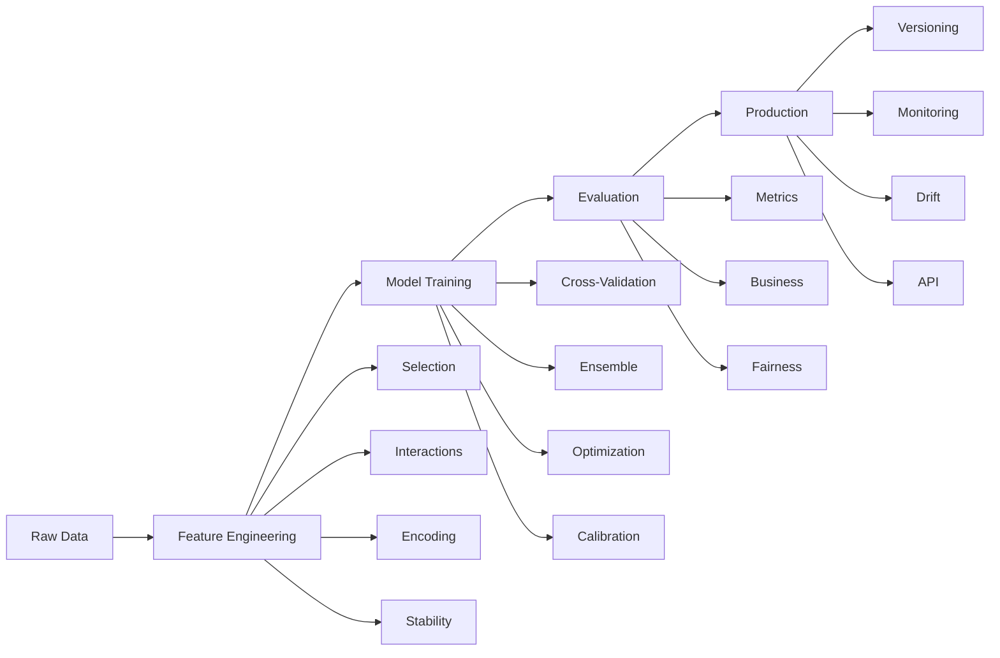

# 🤖 ML Pipeline Module Documentation

## Overview

The ML Pipeline module provides a comprehensive, production-ready machine learning pipeline with advanced feature engineering, ensemble modeling, fairness evaluation, and production deployment capabilities.

## Table of Contents

- [Architecture](#architecture)
- [Components](#components)
- [Quick Start](#quick-start)
- [Feature Engineering](#feature-engineering)
- [Modeling](#modeling)
- [Evaluation](#evaluation)
- [Production Features](#production-features)
- [API Reference](#api-reference)
- [Examples](#examples)
- [Best Practices](#best-practices)
- [Troubleshooting](#troubleshooting)

## Architecture



## Components

### MLPipelineOrchestrator

The main orchestrator that coordinates all pipeline stages.

```python
from modern_bank_churn.ml_pipeline_orchestrator import MLPipelineOrchestrator, PipelineConfig

orchestrator = MLPipelineOrchestrator(config)
```

### PipelineConfig

Configuration object for the pipeline.

```python
@dataclass
class PipelineConfig:
    # Data configuration
    target_column: str = 'churn'
    test_size: float = 0.2
    validation_size: float = 0.15
    random_state: int = 42

    # Feature engineering
    feature_selection_method: str = 'boruta'
    n_features_to_select: int = 20
    detect_interactions: bool = True
    use_target_encoding: bool = True
    stability_check: bool = True

    # Modeling
    model_type: str = 'ensemble'
    base_models: List[str] = field(default_factory=lambda: ['xgboost', 'lightgbm', 'catboost'])
    hyperparameter_tuning: bool = True
    calibrate_model: bool = True

    # Evaluation
    calculate_business_metrics: bool = True
    check_fairness: bool = True
    sensitive_features: List[str] = field(default_factory=lambda: ['gender', 'age_group'])

    # Production
    enable_versioning: bool = True
    check_drift: bool = True
    generate_explanations: bool = True
```

## Quick Start

### Basic Usage

```python
import pandas as pd
from modern_bank_churn.ml_pipeline_orchestrator import MLPipelineOrchestrator, PipelineConfig

# Load your data
data = pd.read_csv('bank_churn_data.csv')

# Configure pipeline
config = PipelineConfig(
    target_column='churn',
    feature_selection_method='boruta',
    model_type='ensemble',
    hyperparameter_tuning=True
)

# Initialize and run
orchestrator = MLPipelineOrchestrator(config)
results = orchestrator.run_pipeline(data)

# Access results
print(f"Test AUC-ROC: {results['evaluation_results']['auc_roc']:.4f}")
print(f"Business ROI: {results['evaluation_results']['business_metrics']['roi']:.2f}")
```

### Advanced Usage

```python
# Custom configuration
config = PipelineConfig(
    # Advanced feature engineering
    feature_selection_method='ensemble',  # Use multiple methods
    n_features_to_select=30,
    detect_interactions=True,
    max_interactions=15,
    stability_check=True,

    # Advanced modeling
    model_type='stacking',
    base_models=['xgboost', 'lightgbm', 'catboost', 'rf', 'et'],
    hyperparameter_tuning=True,
    n_trials=200,  # Optuna trials
    cv_strategy='time_based',  # For temporal data

    # Business-focused evaluation
    calculate_business_metrics=True,
    customer_value_column='ltv',
    retention_cost=100,
    acquisition_cost=500,

    # Production features
    enable_versioning=True,
    check_drift=True,
    generate_explanations=True,
    setup_ab_testing=True
)

# Run with customer values
results = orchestrator.run_pipeline(
    data=data,
    customer_values=data['customer_lifetime_value'],
    quick_mode=False  # Full processing
)
```

## Feature Engineering

### EnhancedFeatureSelector

Multiple feature selection methods with stability analysis.

```python
from enhanced_feature_engineering import EnhancedFeatureSelector

selector = EnhancedFeatureSelector()

# Single method
features = selector.select_features(
    X, y,
    method='boruta',
    n_features=20
)

# Ensemble selection with stability
stable_features = selector.select_stable_features(
    X, y,
    methods=['boruta', 'mutual_info', 'rfe', 'lasso'],
    n_features=20,
    stability_threshold=0.8
)
```

### FeatureInteractionDetector

Automatic detection of feature interactions.

```python
from enhanced_feature_engineering import FeatureInteractionDetector

detector = FeatureInteractionDetector()

# Find interactions
interactions = detector.find_interactions(
    X, y,
    max_interactions=10,
    threshold=0.01
)

# Create interaction features
X_with_interactions = detector.create_interaction_features(
    X, interactions
)
```

### TargetEncoder

Target encoding with cross-validation to prevent leakage.

```python
from enhanced_feature_engineering import TargetEncoder

encoder = TargetEncoder(smoothing=10)

# Fit and transform with CV
X_train_encoded = encoder.fit_transform_cv(
    X_train[categorical_cols],
    y_train,
    cv_folds=5
)

# Transform test data
X_test_encoded = encoder.transform(X_test[categorical_cols])
```

### FeatureStabilityAnalyzer

Analyze feature stability across bootstrap samples.

```python
from enhanced_feature_engineering import FeatureStabilityAnalyzer

analyzer = FeatureStabilityAnalyzer()

stability_scores = analyzer.analyze_stability(
    X, y,
    n_bootstrap=50,
    feature_selector='mutual_info'
)

# Get stable features
stable_features = analyzer.get_stable_features(
    stability_scores,
    threshold=0.8
)
```

## Modeling

### StratifiedCrossValidator

Advanced cross-validation strategies.

```python
from enhanced_modeling import StratifiedCrossValidator

cv = StratifiedCrossValidator()

# Standard stratified CV
scores = cv.cross_validate(
    model, X, y,
    strategy='stratified',
    n_folds=5
)

# Time-based CV for temporal data
scores = cv.cross_validate(
    model, X, y,
    strategy='time_based',
    n_folds=5,
    gap=10  # Gap between train and test
)

# Group-based CV
scores = cv.cross_validate(
    model, X, y,
    strategy='group',
    n_folds=5,
    groups=customer_ids
)
```

### EnhancedEnsembleMethods

Advanced ensemble techniques.

```python
from enhanced_modeling import EnhancedEnsembleMethods

ensemble = EnhancedEnsembleMethods()

# Voting ensemble
voting_model = ensemble.create_voting_ensemble(
    X, y,
    models=['xgboost', 'lightgbm', 'catboost'],
    voting='soft',
    weights=[0.4, 0.3, 0.3]
)

# Stacking ensemble
stacking_model = ensemble.create_stacking_ensemble(
    X, y,
    base_models=['xgboost', 'lightgbm', 'rf'],
    meta_model='logistic',
    cv_folds=5
)

# Blending ensemble
blending_result = ensemble.create_blending_ensemble(
    X_train, y_train, X_val,
    models=['xgboost', 'lightgbm'],
    blend_features=True
)
```

### HyperparameterOptimizer

Bayesian optimization with Optuna.

```python
from enhanced_modeling import HyperparameterOptimizer

optimizer = HyperparameterOptimizer()

# Optimize single model
best_params = optimizer.optimize(
    X, y,
    model_type='xgboost',
    n_trials=100,
    cv_folds=5
)

# Optimize ensemble
ensemble_params = optimizer.optimize_ensemble(
    X, y,
    models=['xgboost', 'lightgbm'],
    n_trials=200
)
```

### ModelCalibrator

Probability calibration for better uncertainty estimates.

```python
from enhanced_modeling import ModelCalibrator

calibrator = ModelCalibrator()

# Isotonic calibration
calibrated_model = calibrator.calibrate_model(
    model, X, y,
    method='isotonic',
    cv_folds=3
)

# Platt scaling
calibrated_model = calibrator.calibrate_model(
    model, X, y,
    method='sigmoid'
)

# Evaluate calibration
calibration_metrics = calibrator.evaluate_calibration(
    calibrated_model, X_test, y_test
)
```

## Evaluation

### BusinessMetricsCalculator

Calculate business-focused metrics.

```python
from enhanced_evaluation import BusinessMetricsCalculator

calculator = BusinessMetricsCalculator(
    avg_customer_value=5000,
    retention_cost=100,
    acquisition_cost=500,
    intervention_success_rate=0.3
)

# Calculate metrics
metrics = calculator.calculate_business_metrics(
    y_true, y_pred, y_prob,
    customer_values=customer_ltv
)

print(f"ROI: {metrics['roi_ratio']:.2f}")
print(f"Expected Value: ${metrics['expected_value']:,.2f}")
print(f"Profit: ${metrics['total_profit']:,.2f}")

# Find optimal threshold
optimal_threshold = calculator.find_optimal_threshold(
    y_true, y_prob,
    metric='profit',
    customer_values=customer_ltv
)
```

### FairnessEvaluator

Evaluate model fairness across groups.

```python
from enhanced_evaluation import FairnessEvaluator

evaluator = FairnessEvaluator()

# Evaluate fairness
fairness_report = evaluator.evaluate_fairness(
    y_true, y_pred, y_prob,
    sensitive_features=X[['gender', 'age_group', 'income_level']]
)

# Check specific metrics
print(f"Demographic Parity Difference: {fairness_report['gender']['dpd']:.3f}")
print(f"Equal Opportunity Difference: {fairness_report['gender']['eod']:.3f}")
print(f"Disparate Impact: {fairness_report['gender']['di']:.3f}")

# Get mitigation suggestions
suggestions = evaluator.suggest_mitigation(fairness_report)
```

### ModelComparisonFramework

Statistical comparison of models.

```python
from enhanced_evaluation import ModelComparisonFramework

comparator = ModelComparisonFramework()

# Compare models
comparison = comparator.compare_models(
    models={'model_a': model_a, 'model_b': model_b},
    X_test, y_test,
    metrics=['auc', 'accuracy', 'f1', 'business_value']
)

# Statistical significance
significance = comparator.test_significance(
    model_a, model_b,
    X_test, y_test,
    n_bootstrap=1000
)

print(f"Model A better with p-value: {significance['p_value']:.4f}")
```

## Production Features

### ModelVersionControl

Version and track models.

```python
from enhanced_production import ModelVersionControl

mvc = ModelVersionControl(registry_path='./model_registry')

# Save model with metadata
model_id = mvc.save_model(
    model=model,
    metadata={
        'features': feature_names,
        'performance': {'auc': 0.92, 'f1': 0.85},
        'training_date': '2024-01-01',
        'data_version': 'v2.1'
    },
    tags=['production', 'churn_model', 'v1.0']
)

# Load model
model, metadata = mvc.load_model(model_id)

# Compare versions
comparison = mvc.compare_versions(model_id_1, model_id_2)

# Promote to production
mvc.promote_model(model_id, environment='production')
```

### DriftDetector

Monitor data and prediction drift.

```python
from enhanced_production import DriftDetector

detector = DriftDetector(
    reference_data=X_train,
    reference_predictions=model.predict_proba(X_train)[:, 1]
)

# Detect drift
drift_report = detector.detect_drift(
    current_data=X_new,
    current_predictions=model.predict_proba(X_new)[:, 1]
)

if drift_report['drift_detected']:
    print(f"Drift detected in features: {drift_report['drifted_features']}")
    print(f"Severity: {drift_report['severity']}")

    # Get recommendations
    for rec in drift_report['recommendations']:
        print(f"- {rec}")
```

### ModelExplainer

SHAP-based model explanations.

```python
from enhanced_production import ModelExplainer

explainer = ModelExplainer(model, X_train)

# Global explanations
global_importance = explainer.get_global_importance()

# Local explanations
local_explanation = explainer.explain_prediction(
    X_test.iloc[0],
    plot=True
)

# Feature interactions
interactions = explainer.get_interaction_effects(
    features=['age', 'balance']
)

# Generate report
explainer.generate_explanation_report(
    X_test[:100],
    output_path='explanations.html'
)
```

### ABTestingFramework

A/B testing for model deployment.

```python
from enhanced_production import ABTestingFramework

ab_test = ABTestingFramework(
    control_model=current_model,
    treatment_model=new_model,
    traffic_split=0.2  # 20% to new model
)

# Route traffic
model_variant, prediction = ab_test.route_traffic(X_sample)

# Log results
ab_test.log_result(
    model_variant,
    X_sample,
    prediction,
    actual_outcome,
    business_value
)

# Analyze results
results = ab_test.analyze_results(min_samples=1000)

if results['winner'] == 'treatment':
    print(f"New model wins with {results['confidence']:.1%} confidence")
    print(f"Lift: {results['lift']:.2%}")
```

## API Reference

### Main Classes

| Class | Description | Module |
|-------|-------------|--------|
| `MLPipelineOrchestrator` | Main pipeline orchestrator | `ml_pipeline_orchestrator` |
| `PipelineConfig` | Pipeline configuration | `ml_pipeline_orchestrator` |
| `EnhancedFeatureSelector` | Feature selection | `enhanced_feature_engineering` |
| `FeatureInteractionDetector` | Interaction detection | `enhanced_feature_engineering` |
| `TargetEncoder` | Target encoding | `enhanced_feature_engineering` |
| `StratifiedCrossValidator` | Cross-validation | `enhanced_modeling` |
| `EnhancedEnsembleMethods` | Ensemble models | `enhanced_modeling` |
| `HyperparameterOptimizer` | Hyperparameter tuning | `enhanced_modeling` |
| `BusinessMetricsCalculator` | Business metrics | `enhanced_evaluation` |
| `FairnessEvaluator` | Fairness evaluation | `enhanced_evaluation` |
| `ModelVersionControl` | Model versioning | `enhanced_production` |
| `DriftDetector` | Drift detection | `enhanced_production` |
| `ModelExplainer` | Model explanations | `enhanced_production` |

### Key Methods

```python
# Pipeline Orchestrator
orchestrator.run_pipeline(data, customer_values=None, quick_mode=False)
orchestrator.run_experiment(data, experiment_config)
orchestrator.load_and_run(data_path, config_path)

# Feature Engineering
selector.select_features(X, y, method, n_features)
detector.find_interactions(X, y, max_interactions)
encoder.fit_transform_cv(X, y, cv_folds)

# Modeling
cv.cross_validate(model, X, y, strategy, n_folds)
ensemble.create_stacking_ensemble(X, y, base_models)
optimizer.optimize(X, y, model_type, n_trials)

# Evaluation
calculator.calculate_business_metrics(y_true, y_pred, y_prob)
evaluator.evaluate_fairness(y_true, y_pred, sensitive_features)

# Production
mvc.save_model(model, metadata)
detector.detect_drift(current_data, current_predictions)
explainer.explain_prediction(X_sample)
```

## Examples

### Example 1: Complete Pipeline for Bank Churn

```python
import pandas as pd
from modern_bank_churn.ml_pipeline_orchestrator import (
    MLPipelineOrchestrator,
    PipelineConfig
)

# Load data
df = pd.read_csv('bank_customers.csv')

# Prepare customer values (optional but recommended)
customer_values = df['estimated_lifetime_value']

# Configure pipeline
config = PipelineConfig(
    # Data
    target_column='churned',
    test_size=0.2,

    # Feature engineering
    feature_selection_method='boruta',
    n_features_to_select=25,
    detect_interactions=True,
    use_target_encoding=True,

    # Modeling
    model_type='stacking',
    base_models=['xgboost', 'lightgbm', 'catboost'],
    hyperparameter_tuning=True,
    n_trials=100,

    # Evaluation
    calculate_business_metrics=True,
    check_fairness=True,
    sensitive_features=['gender', 'age_group'],

    # Production
    enable_versioning=True,
    check_drift=True,
    generate_explanations=True
)

# Run pipeline
orchestrator = MLPipelineOrchestrator(config)
results = orchestrator.run_pipeline(df, customer_values)

# Results
print("Pipeline Results:")
print(f"- AUC-ROC: {results['evaluation_results']['auc_roc']:.4f}")
print(f"- Business ROI: {results['evaluation_results']['business_metrics']['roi']:.2f}")
print(f"- Fairness Score: {results['evaluation_results']['fairness_metrics']['overall_score']:.3f}")
print(f"- Model Version: {results['production_artifacts']['model_id']}")
```

### Example 2: Custom Feature Engineering

```python
from enhanced_feature_engineering import (
    EnhancedFeatureSelector,
    FeatureInteractionDetector,
    TargetEncoder,
    FeatureStabilityAnalyzer
)

# Initialize components
selector = EnhancedFeatureSelector()
detector = FeatureInteractionDetector()
encoder = TargetEncoder()
analyzer = FeatureStabilityAnalyzer()

# 1. Encode categorical variables
categorical_cols = df.select_dtypes(include=['object']).columns
X_encoded = encoder.fit_transform_cv(df[categorical_cols], y, cv_folds=5)

# 2. Find and create interactions
interactions = detector.find_interactions(X_encoded, y, max_interactions=20)
X_with_interactions = detector.create_interaction_features(X_encoded, interactions[:10])

# 3. Select stable features
stability_scores = analyzer.analyze_stability(X_with_interactions, y, n_bootstrap=30)
stable_features = analyzer.get_stable_features(stability_scores, threshold=0.8)

# 4. Final feature selection
final_features = selector.select_features(
    X_with_interactions[stable_features],
    y,
    method='boruta',
    n_features=20
)

print(f"Final features selected: {len(final_features)}")
print(f"Features: {final_features}")
```

### Example 3: Production Deployment

```python
from enhanced_production import (
    ModelVersionControl,
    DriftDetector,
    ModelExplainer,
    ABTestingFramework
)

# 1. Version control
mvc = ModelVersionControl()
model_id = mvc.save_model(
    model=trained_model,
    metadata={
        'algorithm': 'XGBoost',
        'features': feature_names,
        'metrics': {'auc': 0.92, 'f1': 0.85},
        'training_date': datetime.now().isoformat()
    }
)

# 2. Set up drift detection
detector = DriftDetector(X_train, model.predict_proba(X_train)[:, 1])

# 3. Create explainer
explainer = ModelExplainer(model, X_train)

# 4. Set up A/B testing
ab_test = ABTestingFramework(
    control_model=current_production_model,
    treatment_model=trained_model,
    traffic_split=0.1  # 10% to new model
)

# Production inference function
def predict_with_monitoring(X):
    # Check for drift
    drift_report = detector.detect_drift(X)
    if drift_report['drift_detected']:
        alert_team(drift_report)

    # Route through A/B test
    model_variant, predictions = ab_test.route_traffic(X)

    # Generate explanations for high-value customers
    if X['customer_value'] > 10000:
        explanation = explainer.explain_prediction(X)
        store_explanation(explanation)

    return predictions
```

## Best Practices

### 1. Data Preparation
- Always check for data quality issues
- Handle missing values appropriately
- Scale features when necessary
- Split data properly (train/val/test)

### 2. Feature Engineering
- Use cross-validation for target encoding
- Check feature stability
- Limit interaction features to avoid overfitting
- Document feature transformations

### 3. Model Training
- Always use cross-validation
- Consider ensemble methods for production
- Calibrate probabilities for decision-making
- Track experiments and parameters

### 4. Evaluation
- Go beyond accuracy - use business metrics
- Check for fairness across groups
- Validate on truly held-out data
- Consider temporal validation for time-series

### 5. Production
- Version all models and data
- Monitor for drift continuously
- Provide explanations for decisions
- Use A/B testing for deployment

## Troubleshooting

### Common Issues

#### 1. Memory Errors
```python
# Solution: Use data sampling
config.enable_data_sampling = True
config.max_data_points = 100000
```

#### 2. Slow Training
```python
# Solution: Use quick mode for development
results = orchestrator.run_pipeline(data, quick_mode=True)
```

#### 3. Poor Performance
```python
# Solution: Increase feature engineering
config.detect_interactions = True
config.n_features_to_select = 30
config.hyperparameter_tuning = True
config.n_trials = 200
```

#### 4. Drift Detection Issues
```python
# Solution: Adjust sensitivity
detector.drift_threshold = 0.1  # More sensitive
detector.min_samples = 1000  # Require more data
```

### Debug Mode

```python
# Enable debug logging
import logging
logging.basicConfig(level=logging.DEBUG)

# Run with verbose output
config.verbose = True
orchestrator = MLPipelineOrchestrator(config)
```

### Performance Optimization

```python
# Parallel processing
config.n_jobs = -1

# Reduce hyperparameter trials
config.n_trials = 50

# Use simpler models
config.base_models = ['xgboost', 'lightgbm']

# Disable expensive features
config.stability_check = False
config.detect_interactions = False
```

## Resources

- [Paper: Feature Engineering Best Practices](https://arxiv.org/xxx)
- [Book: The Elements of Statistical Learning](https://web.stanford.edu/~hastie/ElemStatLearn/)
- [Article: MLOps Principles](https://ml-ops.org)
- [Tutorial: SHAP Values Explained](https://shap.readthedocs.io)

---

[Back to Main Documentation](../../README.md)