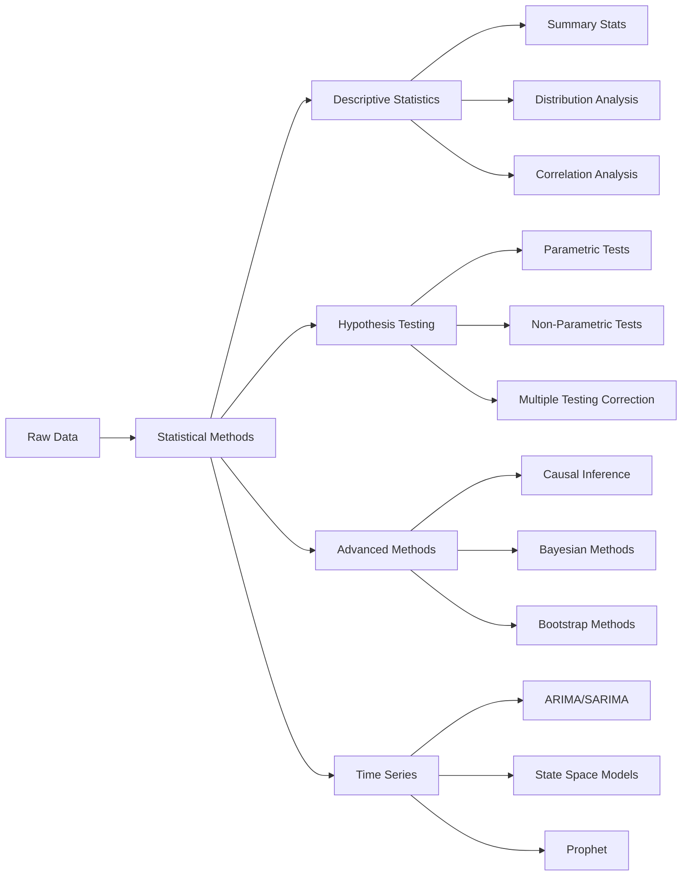

# 📊 Statistical Methods Module

## Overview

The Statistical Methods module provides a comprehensive suite of statistical analysis tools, hypothesis testing frameworks, and advanced statistical modeling capabilities for data science projects.

## 🏗️ Architecture



## 📦 Components

### Core Classes

#### `StatisticalAnalyzer`
Main class for statistical analysis operations.

```python
from statistical_methods.statistical_analyzer import StatisticalAnalyzer

analyzer = StatisticalAnalyzer(data=df)
summary = analyzer.generate_summary()
```

#### `HypothesisTester`
Comprehensive hypothesis testing framework.

```python
from statistical_methods.hypothesis_tester import HypothesisTester

tester = HypothesisTester()
result = tester.t_test(group1, group2, alternative='two-sided')
```

#### `CausalInference`
Advanced causal inference methods.

```python
from statistical_methods.causal_inference import CausalInference

ci = CausalInference()
ate = ci.estimate_ate(treatment, outcome, confounders)
```

#### `BayesianAnalysis`
Bayesian statistical methods and MCMC.

```python
from statistical_methods.bayesian_analysis import BayesianAnalysis

bayesian = BayesianAnalysis()
posterior = bayesian.fit_model(prior, data, likelihood)
```

#### `TimeSeriesAnalysis`
Time series modeling and forecasting.

```python
from statistical_methods.time_series import TimeSeriesAnalysis

ts = TimeSeriesAnalysis(data=time_series_df)
forecast = ts.prophet_forecast(periods=30)
```

## 🚀 Quick Start

### Installation

```bash
pip install -r statistical_methods/requirements.txt
```

### Basic Usage

```python
import pandas as pd
from statistical_methods import StatisticalAnalyzer, HypothesisTester

# Load data
data = pd.read_csv('data.csv')

# Descriptive statistics
analyzer = StatisticalAnalyzer(data)
summary = analyzer.generate_summary()
print(summary)

# Hypothesis testing
tester = HypothesisTester()
result = tester.anova(data, groups='category', values='metric')
print(f"F-statistic: {result['f_statistic']}, p-value: {result['p_value']}")
```

## 📚 API Reference

### StatisticalAnalyzer

```python
class StatisticalAnalyzer:
    """
    Comprehensive statistical analysis toolkit.

    Parameters
    ----------
    data : pd.DataFrame
        Input data for analysis
    confidence_level : float, default=0.95
        Confidence level for intervals
    """

    def generate_summary(self, include_plots=True):
        """
        Generate comprehensive statistical summary.

        Returns
        -------
        dict
            Summary statistics including mean, median, std, quantiles
        """
        pass

    def distribution_analysis(self, column, test_distributions=['normal', 'exponential']):
        """
        Test data against various distributions.

        Parameters
        ----------
        column : str
            Column to analyze
        test_distributions : list
            Distributions to test

        Returns
        -------
        dict
            Distribution fit results and p-values
        """
        pass

    def correlation_analysis(self, method='pearson', threshold=0.5):
        """
        Compute correlation matrix with significance tests.

        Parameters
        ----------
        method : str
            Correlation method ('pearson', 'spearman', 'kendall')
        threshold : float
            Significance threshold

        Returns
        -------
        pd.DataFrame
            Correlation matrix with p-values
        """
        pass
```

### HypothesisTester

```python
class HypothesisTester:
    """
    Hypothesis testing framework with multiple testing correction.

    Parameters
    ----------
    alpha : float, default=0.05
        Significance level
    correction_method : str, default='bonferroni'
        Multiple testing correction method
    """

    def t_test(self, group1, group2, alternative='two-sided', paired=False):
        """
        Perform t-test between two groups.

        Parameters
        ----------
        group1, group2 : array-like
            Data for comparison
        alternative : str
            Alternative hypothesis ('two-sided', 'less', 'greater')
        paired : bool
            Whether to perform paired t-test

        Returns
        -------
        dict
            Test statistic, p-value, confidence interval
        """
        pass

    def anova(self, data, groups, values, post_hoc='tukey'):
        """
        One-way ANOVA with post-hoc tests.

        Parameters
        ----------
        data : pd.DataFrame
            Input data
        groups : str
            Column name for groups
        values : str
            Column name for values
        post_hoc : str
            Post-hoc test method

        Returns
        -------
        dict
            ANOVA results and post-hoc comparisons
        """
        pass

    def chi_square_test(self, observed, expected=None):
        """
        Chi-square test for independence.

        Parameters
        ----------
        observed : array-like
            Observed frequencies
        expected : array-like, optional
            Expected frequencies

        Returns
        -------
        dict
            Chi-square statistic and p-value
        """
        pass
```

### CausalInference

```python
class CausalInference:
    """
    Causal inference methods including propensity score matching and IV.

    Parameters
    ----------
    method : str, default='propensity'
        Causal inference method
    """

    def estimate_ate(self, treatment, outcome, confounders, method='ipw'):
        """
        Estimate Average Treatment Effect.

        Parameters
        ----------
        treatment : array-like
            Treatment assignment
        outcome : array-like
            Outcome variable
        confounders : pd.DataFrame
            Confounding variables
        method : str
            Estimation method ('ipw', 'matching', 'regression')

        Returns
        -------
        dict
            ATE estimate with confidence intervals
        """
        pass

    def propensity_score_matching(self, data, treatment_col, outcome_col,
                                  covariates, caliper=0.1):
        """
        Perform propensity score matching.

        Parameters
        ----------
        data : pd.DataFrame
            Input data
        treatment_col : str
            Treatment column name
        outcome_col : str
            Outcome column name
        covariates : list
            List of covariate columns
        caliper : float
            Matching caliper

        Returns
        -------
        pd.DataFrame
            Matched data with treatment effects
        """
        pass
```

### BayesianAnalysis

```python
class BayesianAnalysis:
    """
    Bayesian statistical methods and MCMC sampling.

    Parameters
    ----------
    sampler : str, default='nuts'
        MCMC sampler type
    n_samples : int, default=2000
        Number of MCMC samples
    """

    def fit_model(self, model_spec, data, priors=None):
        """
        Fit Bayesian model using MCMC.

        Parameters
        ----------
        model_spec : str or callable
            Model specification
        data : dict
            Data dictionary
        priors : dict, optional
            Prior distributions

        Returns
        -------
        object
            Fitted model with posterior samples
        """
        pass

    def bayesian_ab_test(self, control, treatment, prior_alpha=1, prior_beta=1):
        """
        Bayesian A/B testing.

        Parameters
        ----------
        control : array-like
            Control group data
        treatment : array-like
            Treatment group data
        prior_alpha, prior_beta : float
            Beta prior parameters

        Returns
        -------
        dict
            Posterior distributions and probability of improvement
        """
        pass
```

### TimeSeriesAnalysis

```python
class TimeSeriesAnalysis:
    """
    Time series analysis and forecasting.

    Parameters
    ----------
    data : pd.DataFrame
        Time series data
    date_col : str
        Date column name
    value_col : str
        Value column name
    """

    def stationarity_tests(self):
        """
        Test for stationarity (ADF, KPSS).

        Returns
        -------
        dict
            Test statistics and p-values
        """
        pass

    def decomposition(self, method='seasonal'):
        """
        Time series decomposition.

        Parameters
        ----------
        method : str
            Decomposition method

        Returns
        -------
        object
            Decomposition results (trend, seasonal, residual)
        """
        pass

    def arima_forecast(self, order=None, seasonal_order=None, periods=30):
        """
        ARIMA/SARIMA forecasting.

        Parameters
        ----------
        order : tuple, optional
            ARIMA order (p, d, q)
        seasonal_order : tuple, optional
            Seasonal order (P, D, Q, s)
        periods : int
            Forecast periods

        Returns
        -------
        pd.DataFrame
            Forecast with confidence intervals
        """
        pass

    def prophet_forecast(self, periods=30, include_holidays=True):
        """
        Prophet forecasting.

        Parameters
        ----------
        periods : int
            Forecast periods
        include_holidays : bool
            Include holiday effects

        Returns
        -------
        pd.DataFrame
            Forecast with components
        """
        pass
```

## 📝 Examples

### Example 1: Comprehensive Statistical Analysis

```python
import pandas as pd
from statistical_methods import StatisticalAnalyzer

# Load and analyze data
data = pd.read_csv('customer_data.csv')
analyzer = StatisticalAnalyzer(data)

# Generate comprehensive report
report = analyzer.generate_summary()

# Distribution testing
dist_results = analyzer.distribution_analysis(
    column='revenue',
    test_distributions=['normal', 'lognormal', 'gamma']
)

# Correlation analysis with significance
correlations = analyzer.correlation_analysis(
    method='spearman',
    threshold=0.3
)

print(f"Best fitting distribution: {dist_results['best_fit']}")
print(f"Significant correlations: {correlations[correlations['p_value'] < 0.05]}")
```

### Example 2: A/B Testing with Multiple Corrections

```python
from statistical_methods import HypothesisTester

tester = HypothesisTester(alpha=0.05, correction_method='fdr')

# Multiple metrics testing
metrics = ['conversion', 'revenue', 'engagement', 'retention']
results = {}

for metric in metrics:
    result = tester.t_test(
        control_data[metric],
        treatment_data[metric],
        alternative='two-sided'
    )
    results[metric] = result

# Apply multiple testing correction
corrected_results = tester.apply_correction(results)

# Print significant results
for metric, result in corrected_results.items():
    if result['corrected_p_value'] < 0.05:
        print(f"{metric}: p={result['corrected_p_value']:.4f}, "
              f"effect={result['effect_size']:.3f}")
```

### Example 3: Causal Inference with Propensity Scores

```python
from statistical_methods import CausalInference

ci = CausalInference()

# Estimate treatment effect with confounders
ate = ci.estimate_ate(
    treatment=data['treated'],
    outcome=data['outcome'],
    confounders=data[['age', 'income', 'education']],
    method='ipw'
)

print(f"Average Treatment Effect: {ate['estimate']:.3f}")
print(f"95% CI: [{ate['ci_lower']:.3f}, {ate['ci_upper']:.3f}]")

# Propensity score matching
matched_data = ci.propensity_score_matching(
    data=data,
    treatment_col='treatment',
    outcome_col='revenue',
    covariates=['age', 'income', 'region'],
    caliper=0.05
)

print(f"Matched sample size: {len(matched_data)}")
print(f"Balance improvement: {matched_data['balance_stats']}")
```

### Example 4: Bayesian A/B Testing

```python
from statistical_methods import BayesianAnalysis

bayesian = BayesianAnalysis()

# Bayesian A/B test
result = bayesian.bayesian_ab_test(
    control=control_conversions,
    treatment=treatment_conversions,
    prior_alpha=1,
    prior_beta=1
)

print(f"Probability of improvement: {result['prob_improvement']:.2%}")
print(f"Expected lift: {result['expected_lift']:.3f}")
print(f"Risk of choosing treatment: {result['risk']:.3f}")

# Visualize posterior distributions
result['posterior_plot'].show()
```

### Example 5: Time Series Forecasting

```python
from statistical_methods import TimeSeriesAnalysis

ts = TimeSeriesAnalysis(
    data=sales_data,
    date_col='date',
    value_col='sales'
)

# Test stationarity
stationarity = ts.stationarity_tests()
print(f"ADF p-value: {stationarity['adf_pvalue']:.4f}")

# Decomposition
decomp = ts.decomposition(method='seasonal')

# ARIMA forecast with auto-selection
forecast = ts.arima_forecast(
    order=None,  # Auto-select
    periods=90
)

# Prophet forecast with holidays
prophet_forecast = ts.prophet_forecast(
    periods=90,
    include_holidays=True
)

# Compare forecasts
comparison = ts.compare_forecasts([forecast, prophet_forecast])
print(f"Best model: {comparison['best_model']}")
```

## 🎯 Best Practices

### 1. **Data Validation**
```python
# Always validate data before analysis
analyzer = StatisticalAnalyzer(data)
validation = analyzer.validate_data()

if validation['missing_pct'] > 0.1:
    print("Warning: High missing data percentage")

if not validation['normality_tests']['passed']:
    print("Data not normally distributed - use non-parametric tests")
```

### 2. **Multiple Testing Correction**
```python
# Always apply correction for multiple comparisons
tester = HypothesisTester(correction_method='bonferroni')
results = tester.multiple_tests(tests_dict)
```

### 3. **Effect Size Reporting**
```python
# Report effect sizes alongside p-values
result = tester.t_test(group1, group2)
print(f"Cohen's d: {result['cohens_d']:.3f}")
print(f"Practical significance: {result['practical_significance']}")
```

### 4. **Assumption Checking**
```python
# Check assumptions before tests
assumptions = tester.check_assumptions(data, test_type='anova')
if not assumptions['homogeneity_of_variance']:
    # Use Welch's ANOVA instead
    result = tester.welch_anova(data)
```

### 5. **Sensitivity Analysis**
```python
# Perform sensitivity analysis for causal inference
ci = CausalInference()
sensitivity = ci.sensitivity_analysis(
    treatment_effect=ate,
    unmeasured_confounding_range=(-0.5, 0.5)
)
```

## 🐛 Troubleshooting

### Common Issues and Solutions

#### 1. **Convergence Issues in Bayesian Models**
```python
# Increase samples and tune sampler
bayesian = BayesianAnalysis(
    sampler='nuts',
    n_samples=5000,
    n_warmup=1000,
    target_accept=0.9
)
```

#### 2. **Multicollinearity in Regression**
```python
# Check VIF before regression
from statistical_methods.diagnostics import check_vif

vif_scores = check_vif(data[predictors])
high_vif = vif_scores[vif_scores > 10]

if len(high_vif) > 0:
    print(f"High VIF variables: {high_vif.index.tolist()}")
    # Consider removing or combining variables
```

#### 3. **Non-convergent Time Series**
```python
# Apply differencing for non-stationary series
ts = TimeSeriesAnalysis(data)
if not ts.is_stationary():
    ts.apply_differencing(order=1)
    # Or use seasonal differencing
    ts.apply_seasonal_differencing(period=12)
```

## 📊 Performance Considerations

### Memory Optimization
```python
# Use chunked processing for large datasets
analyzer = StatisticalAnalyzer(
    data=data,
    chunk_size=10000,
    use_dask=True
)
```

### Parallel Processing
```python
# Enable parallel processing for bootstrap
from statistical_methods import BootstrapAnalysis

bootstrap = BootstrapAnalysis(
    n_bootstrap=10000,
    n_jobs=-1  # Use all cores
)
```

### Caching Results
```python
# Cache expensive computations
analyzer = StatisticalAnalyzer(
    data=data,
    cache_enabled=True,
    cache_dir='./cache'
)
```

## 🔗 Related Modules

- [ML Pipeline](ml_pipeline.md) - Machine learning workflows
- [Dashboard](dashboard.md) - Visualization and reporting
- [Data Processing](data_processing.md) - ETL and preprocessing

## 📚 References

1. Wasserman, L. (2004). All of Statistics
2. Gelman, A. et al. (2013). Bayesian Data Analysis
3. Pearl, J. (2009). Causality
4. Box, G. E. P. & Jenkins, G. M. (1976). Time Series Analysis
5. Efron, B. & Tibshirani, R. (1993). An Introduction to the Bootstrap

---

For more information, see the [main documentation](../../README_ENHANCED.md).